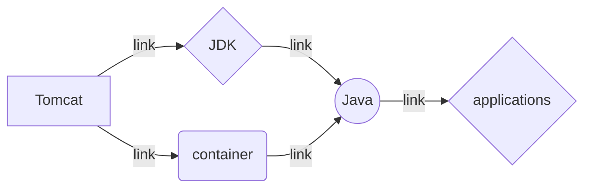

# tomcat 

### use the tomcat for Java

```mermaid
graph LR
A[Tomcat] --link--> B{JDK} 
B --link--> C((Java))
A --link--> D(container)
D --link--> C
C --link--> E{applications}
```

<!--stackedit_data:
eyJoaXN0b3J5IjpbMjA0Mzk0MzQxMCwtMTU2MDc5Nzc3N119
-->